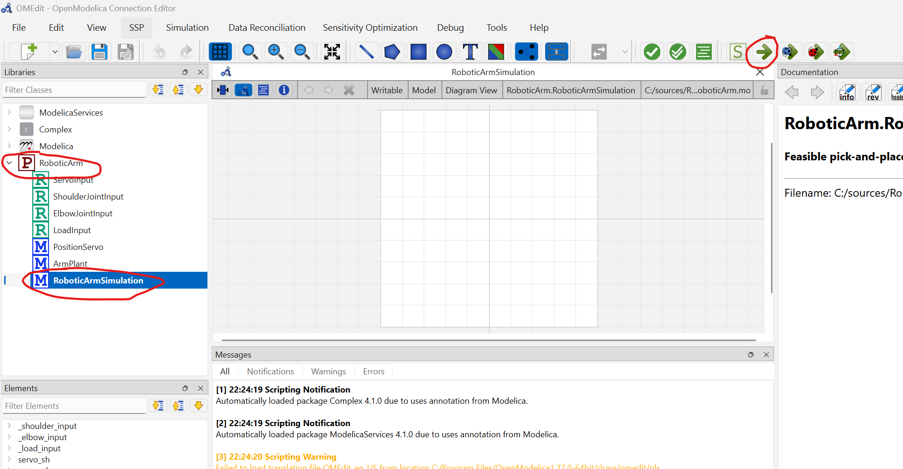
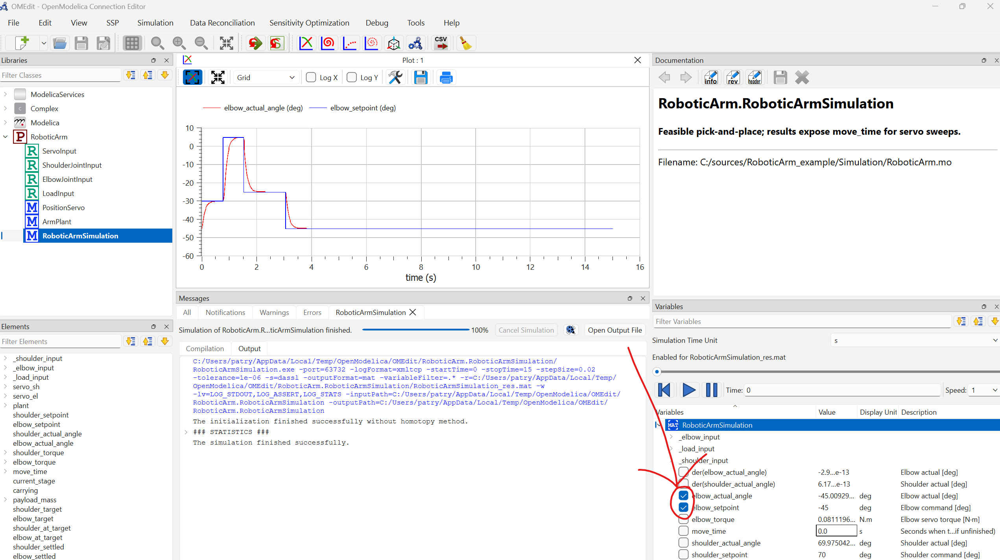

# RoboticArm Simulation Example

This repository models a simple two-joint robotic arm (shoulder and elbow) in
[OpenModelica](https://openmodelica.org/). The Python scripts around it help you
explore the servo trade space: choosing a real off-the-shelf servo for each
joint while balancing cost against how quickly the arm completes its motion.

You do not need prior experience with Modelica or Python to use this project.
This guide walks you through installation, setup, simulation, and plotting in a
straightforward way.

---

## 1. Prerequisites

You need four things installed on your machine:

1. **Visual Studio Code** — recommended for editing files and running commands
   from the integrated terminal. Install it from
   [code.visualstudio.com](https://code.visualstudio.com/).

2. **Python 3.10+** — check the installation with:
   ```
   python --version
   ```
   If that fails, install Python from [python.org](https://www.python.org/downloads/).
   On Windows, make sure you tick "Add python.exe to PATH" during installation.

3. **OpenModelica** — required to run new simulations. Install it from
   [openmodelica.org](https://openmodelica.org/) and keep the default settings.

4. **Git** — needed to clone the repository and track changes. Install it from
   [git-scm.com](https://git-scm.com/downloads/windows) and accept the default
   options during setup.

---

## 2. Setup

Open Visual Studio Code, then open a terminal and run the following commands from
the folder where you want to store the project:

```bash
git clone https://github.com/PatrykPrezyna/RoboticArm_example.git
cd RoboticArm_example
python -m venv .venv
.\.venv\Scripts\Activate.ps1   # PowerShell
# or .\.venv\Scripts\activate in Command Prompt
pip install -r requirements.txt
```

The project already contains the required Python dependency, which is currently
listed in [requirements.txt](requirements.txt).

---

## 3. Open Modelica and run the default parameters first

Open [Simulation/RoboticArm.mo](Simulation/RoboticArm.mo) in OpenModelica.
From there, load the model and run the default example to confirm that the
simulation works before moving on to the Python workflow.

The images in the repository show the expected workflow in the OpenModelica GUI:





This first run is useful because it gives you a quick sanity check that the model
loads correctly and that your OpenModelica installation is working.

---

## 4. Run the simulation for one default setup

You can also run the model from Python with the default settings:

```bash
cd Simulation
python simulate_one.py
```

This runs the simulation once and writes a result row to the output folder.
The script uses the default parameter values defined by the project and produces
an output CSV file in the output directory.

If you want to try a different value, you can override individual parameters from
the command line. For example:

```bash
python simulate_one.py --shoulder-servo-tau-stall 0.92 --elbow-servo-tau-stall 5.88
```

---

## 5. Run the simulation for combinations of setups

The project also includes JSON-based input files in [Simulation](Simulation/),
which make it easier to run one configuration or many combinations.

Run a single configuration from a JSON file:

```bash
python run_from_json.py default_input.json
```

Run a sweep over many combinations:

```bash
python run_sweep.py full_input.json
```

The example files in [Simulation](Simulation/) already contain useful starting
points:

- [Simulation/default_input.json](Simulation/default_input.json) — a single default setup
- [Simulation/full_input.json](Simulation/full_input.json) — a broader sweep with several servo options

The sweep script explores the Cartesian product of the candidate values and writes
its results to [Simulation/sim_sweep_result.csv](Simulation/sim_sweep_result.csv).

---

## 6. Generate a tradespace

Once you have sweep results, you can generate a trade-space plot:

```bash
python plot_tradespace.py
```

This writes [Simulation/tradespace.png](Simulation/tradespace.png), which shows
servo cost on the horizontal axis and motion time on the vertical axis. Blue
points represent successful runs, while red X markers indicate combinations that
did not finish before the stop time.

If you want to save the plot under a different name, use:

```bash
python plot_tradespace.py --output my_plot.png
```

---

## 7. Customize your own input

If you want to experiment further, create or edit your own JSON files in
[Simulation](Simulation/). The Python scripts read those files and convert the
values into the model inputs for you.

A good starting point is to change the servo options, adjust the motion
sequences, or try different link masses and lengths. Keeping the structure of
the existing JSON files will make the scripts work as expected.

---

## 8. Troubleshooting

**"OpenModelica 'omc' not found"** — the scripts could not locate the
OpenModelica compiler. Either:

- reinstall OpenModelica and let the setup finish completely, or
- find your OpenModelica install folder manually and add its `bin` subfolder to
  your `PATH`.

**A plot or result file looks stale** — delete the output folder and run the
simulation again. The project regenerates its outputs each time.

**`ModuleNotFoundError: No module named 'matplotlib'`** — run
`pip install -r requirements.txt` from the repository root.

---

## 9. Git basics (if you have never used Git before)

Git tracks changes to this project over time. A few commands cover most of what
you will need day to day. Run them from inside the repository folder in a
terminal:

| Command | What it does |
|---|---|
| `git status` | Shows what has changed since the last save point (commit) |
| `git add <file>` | Stages a file so it is included in the next commit |
| `git commit -m "message"` | Saves a snapshot of the staged changes with a short description |
| `git pull` | Downloads and merges changes from GitHub |
| `git push` | Uploads your commits to GitHub |
| `git log --oneline` | Shows the history of commits |

A typical workflow after changing a file, for example a sweep input, looks like
this:

```bash
git status
git add Simulation/full_input.json
git commit -m "Try a wider servo sweep"
git push
```

If you are not sure whether something is safe to run, `git status` is always a
safe first step because it only shows information and does not change anything.
